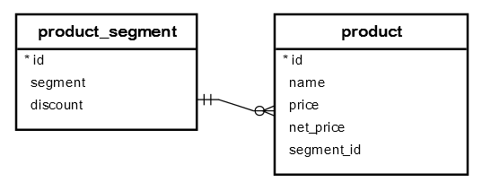

# Insert, update and delete operations

* Insert, update or delete based on some condition or all
* Insert(`INSERT SELECT`), update(`UPDATE JOIN`) or delete(`DELETE USING`) based on another table's data.
* Modifying the return values of these statements using `RETURNING` clause.

**NOTE**: Any CRUD operation query on a **table data** will not contain the **table** keyword in the query. Only table management commands like create table, alter table etc contain **table** keyword.

## Insert

```sql
-- insert data in to a table
INSERT INTO table(column1, column2, …)
VALUES
  (value1, value2, …),
  (value1, value2, …),
  (value1, value2, …),...;


-- insert data from another table
INSERT INTO table(column1,column2,...)
SELECT column1,column2,...
FROM another_table
WHERE condition;
```

> If you omit any column that accepts the `NULL` value in the INSERT statement, the column will take its **default value**. In case the default value is not set for the column, the column will take the NULL value.
> If you want to insert a string that contains a single quote character such as O'Reilly Media, you have to use another single quote (‘) as the escape character

* If we have configured a default value for a column, then we can use `DEFAULT`as the value while inserting. If no default value is configured, the column value is set to `NULL`.

```Sql
-- Student table with id, name, age, course, ta
-- default for course is not configured, then Null is assigned
INSERT INTO student (name, age, course, ta)
  VALUES
  ('John O''Niel', 23, DEFAULT),
  ('Jane Doe', 23, 'Economics');

-- Assume we have a table called teaching_assistant id, name, course
-- this is an example of populating rows from another table.
INSERT INTO teaching_assistant (name, course)
SELECT name, course
FROM student
WHERE ta = true AND course IS NOT NULL
RETURNING id;
```

* To add a default value for an existing column in a table use the below command

```sql
ALTER TABLE <table_name>
ALTER COLUMN <column_name>
SET DEFAULT <default_value>;
```

* To get the last insert id from the table after inserting a new row, you use the `RETURNING` clause in the `INSERT` statement.

## Update statement

* Update one or more columns in a row or multiple rows.

```Sql
UPDATE table
SET column1 = value1,
    column2 = value2 ,...
WHERE
  condition;
```

* Examples

```Sql
-- suppose we have added false as the default value for ta column
-- in the student table, this below query updates all the rows
-- where ta is set to NULL to false.
UPDATE
  student
SET
  ta = DEFAULT
WHERE
  ta IS NULL;

-- This will update all the rows
UPDATE
  student
SET
  ta = false;
```

* We can update a column with value of some other column from the same table

```Sql
-- suppose we have a full name column added later
-- and we have first and last name
UPDATE
  student
SET
  full_name = first_name || ' ' || last_name;
```

> The `UPDATE` statement returns the number of affected rows by default. The PostgreSQL `UPDATE` statement also returns updated entries using the `RETURNING` clause. This addition is a PostgreSQL’s extension to the SQL standard.

```Sql
UPDATE
  student
SET
  course = 'Philisophy'
WHERE
  id = 10;
RETURNING id,
        name,
        course;
```

## Delete statement

* By default, returns the number of rows that are deleted.

```Sql
-- delete all rows
DELETE FROM <table_name>
[RETURNING *];

-- delete only rows satisfying some condition
DELETE FROM <table_name>
WHERE condition;

-- delete based on data from another table
DELETE FROM table
USING another_table
WHERE table.id = another_table.id AND ...;

-- OR using a subquery
DELETE FROM table
WHERE table.id IN (SELECT id FROM another_table);
```

* If we add `RETURNING *` the `DELETE` statement will return all the rows deleted.

## Update join

```Sql
UPDATE A
SET A.c1 = expression
FROM B
WHERE A.c2 = B.c2;
```

* Example:



```Sql
-- update discount of all the products by segments
UPDATE product
SET net_price = price - price * discount
FROM
  product_segment
WHERE
  product.segment_id = product_segment.id;
```

## Upsert (`INSERT ON CONFLICT`)

* Merge operation that happens when trying to insert a row that is already present in the table.

```Sql
-- ON CONFLICT clause is only available from PostgreSQL 9.5
INSERT INTO table_name(column_list) VALUES(value_list)
ON CONFLICT target action;
```

The target can be:

* (column_name)
* `ON CONSTRAINT constraint_name`
* `WHERE <condition>`

The action can be:

* `DO NOTHING`
* `DO UPDATE SET column_1 = value_1, .. WHERE condition`

* For examples on upsert, refer [postgresql upsert](https://www.postgresqltutorial.com/postgresql-upsert/)

---

## References

* [Insert](https://www.postgresqltutorial.com/postgresql-insert/)
* [Update](https://www.postgresqltutorial.com/postgresql-update/)
* [Delete](https://www.postgresqltutorial.com/postgresql-delete/)
* [Update join](https://www.postgresqltutorial.com/postgresql-update-join/)
* [Upsert](https://www.postgresqltutorial.com/postgresql-upsert/)
