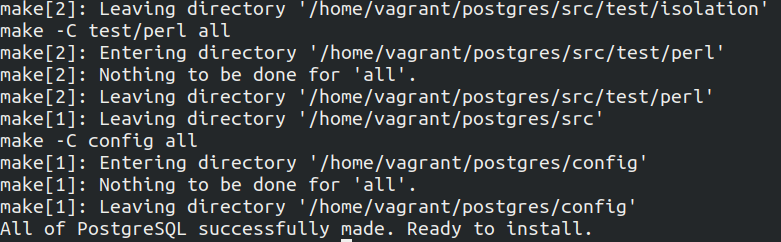

# PostgreSQL

## Setup

* Use the **Vagrantfile** to launch the arch linux VM.

## 1- Installing using pacman

```Bash
# https://wiki.archlinux.org/index.php/PostgreSQL
# This will install postgresql V12
sudo pacman -S postgresql
sudo -iu postgres
# initializes database cluster
initdb -D /var/lib/postgres/data
pg_ctl -D /var/lib/postgres/ -l logfile start

# enabling postgresql.service
# Reference: https://wiki.archlinux.org/index.php/Systemd#Using_units
```

## 2 - Installing postgresql from source

This will install latest postgresql version.

```Bash
# run the following commands from inside the arch linux VM
# Install these if not already installed
sudo pacman -S git flex
mkdir postgres && cd postgres
git clone https://github.com/postgres/postgres.git .

# This will do the default installation
./configure
make # make all
```

* In case you run in to any issues during make like some prerequisite is missing, then install the required software and then run the below commands

```Bash
# This is equivalent of rebuilding from the beginning.
# Last line should be
# "All of PostgreSQL successfully made. Ready to install."
# to indicate the build succeeded.
./configure
make # or `make all` or `make world` to build everything
```

* On successful build process, the shell looks like 

* Verifying and installing the build.

```Bash
# runs the test on the build
make check

# installs the built files
sudo make install

# installing the docs
make install-docs
```

* Please make sure that you have the lastest master build of PostgreSQL. Clone the source from [https://github.com/postgres/postgres](https://github.com/postgres/postgres)

### Running the postgresql server

```Bash
# Reference: https://www.postgresql.org/docs/9.1/server-start.html
sudo chown -R postgres:postgres /usr/local/pgsql
sudo -iu postgres
initdb -D /usr/local/pgsql/data
pg_ctl start -D /usr/local/pgsql/data
```

## Optional

* Download PG14DEV doc from [here](https://sourceforge.net/projects/strikr/files/postgresql/), I have already downloaded the doc and it is present as **pgdev.tar.xz** compressed file.
* If you have already built from the source, you can build the documentation as well.

## About

* version: pg14 (master)
* platform: Arch Linux x86_64
* toolchain: GCC 11.x master

## Note

* To setup the environment variables, please refer to README inside the package
* source ./do_set_env.sh

## Feedback

mailto:foss@strikr.io

---

## References

* [Postgresql build from source](https://www.postgresql.org/docs/current/install-procedure.html)
